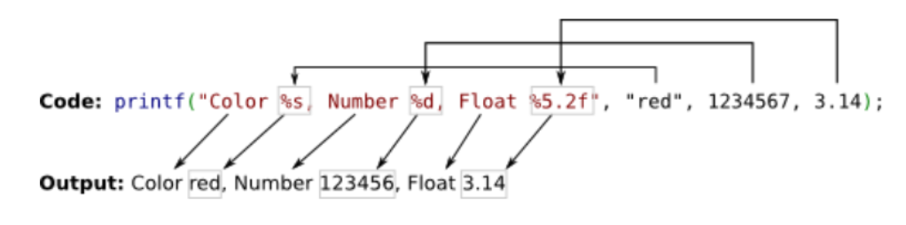

ft_printf
=========

<div align="center">
	<strong><span style="font-size: 1.25em;">My implementation of the printf function from scratch</span></strong>
	<br />
	<br />
	<a href="https://42.fr/">
		
	</a>
	<a href="https://en.cppreference.com/w/c">
		
	</a>
	<a href="https://www.gnu.org/software/make/">
		
	</a>
</div>



## Overview
This project is my third 42 school assignment to recreate the `printf` function and some of its parsing and expansion (formatting) cases. To build it, I use variadic functions, my own library from the Libft project, and the standard C functions `malloc`, `free`, and `write`.

## Key Features
- Variadic function handling and safe casting for each format case.
- Parsing and formatting strings using `%` as the delimiter.
- Base conversions (decimal/hex) and numeric representation in C.
- Understanding C data types, their sizes, and low-level bit operations.

## Formatted Cases
We replicate the formatting cases used by `printf`:

| Specifier | Description |
| --- | --- |
| `c` | Single character |
| `s` | String |
| `d`, `i` | Signed decimal integer |
| `u` | Unsigned integer |
| `p` | Memory address (pointer) |
| `x` | Hexadecimal (lowercase) |
| `X` | Hexadecimal (uppercase) |
| `%%` | Literal percent sign |

## 🛠️ Requirements
Install required packages (Ubuntu/Debian):
```bash
sudo apt update
sudo apt install -y make
sudo apt install -y gcc
```

Libft is included in this project (my own library), no extra install needed.

## 🧱 Build
```bash
git clone <your-repo-url>
cd printf
make
```
This builds the static library for handling `printf`.

## ▶️ Run
Example `main.c`:
```c
#include "ft_printf.h"

int main(void)
{
	ft_printf("Hello %s, number: %d\n", "World", 42);
	return 0;
}
```

Compile and link with the static library:
```bash
cc -Wall -Wextra -Werror main.c libftprintf.a -o demo
./demo
```

Example output:
```text
Hello World, number: 42
```

You can also run the included tests in the `test` folder:
```bash
make test
```

## ℹ️ Resources
### Numeric Bases and Base Conversion
- [Video: Hexadecimal system](https://www.youtube.com/watch?v=WGN4NWICTpQ)
- [Video: How computers count](https://www.youtube.com/watch?v=X74MyYIUEdk)
- [Video: What a base is (math)](https://www.youtube.com/watch?v=Y32SbYUfevw)
- [Video: Base conversion](https://www.youtube.com/watch?v=PH5-goOj-rE&feature=youtu.be)

### Variadic Functions
- [Notion notes: Funciones variadicas](https://broken-snowdrop-f03.notion.site/Funciones-vari-dicas-142b80eb3d88802aa3d1d2f465d14a16)
- [Video: Variadic functions in C](https://www.youtube.com/watch?v=7Sph8JlRo0g)

### printf
- [IBM printf reference](https://www.ibm.com/docs/es/i/7.5.0?topic=functions-printf-print-formatted-characters)
- `man printf` (RTFM)
- [UC3M notes on printf (ES)](https://www.it.uc3m.es/pbasanta/asng/course_notes/input_output_printf_es.html)

## 👨‍💻 Author
[Alejandro Carrillo (alcarril)](https://github.com/alcarril)
